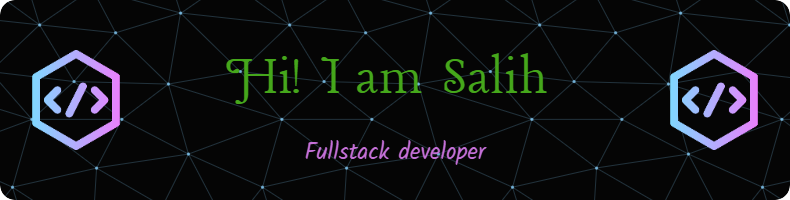

<h3 align="center">A passionate fullstack developer from Turkey</h3>

  

🔭 I’m currently working on **Mastering React**

🌱 I’m currently looking for the opportunity to gain first experience as a front end developer.

📫 How to reach me <a href="#">salihsevercann@gmail.com</a>

<h2 align="left">Connect with me:</h2>

<h2 align="left"> 💻 Languages and Tools:</h2>

             
  

 

<!--  -->

<!--  -->

 

 

## 🏆 GitHub Trophies

 

  

&nbsp;

  

  
  

<h3 align="left">📫 &nbsp;Feel Free to Contact me.....</h3>

	
	
	

<b> Thank You for visiting my profile 🙏</b>

 <b style = {font-weight: 600}>Visitors Count</b>

 
 

  

